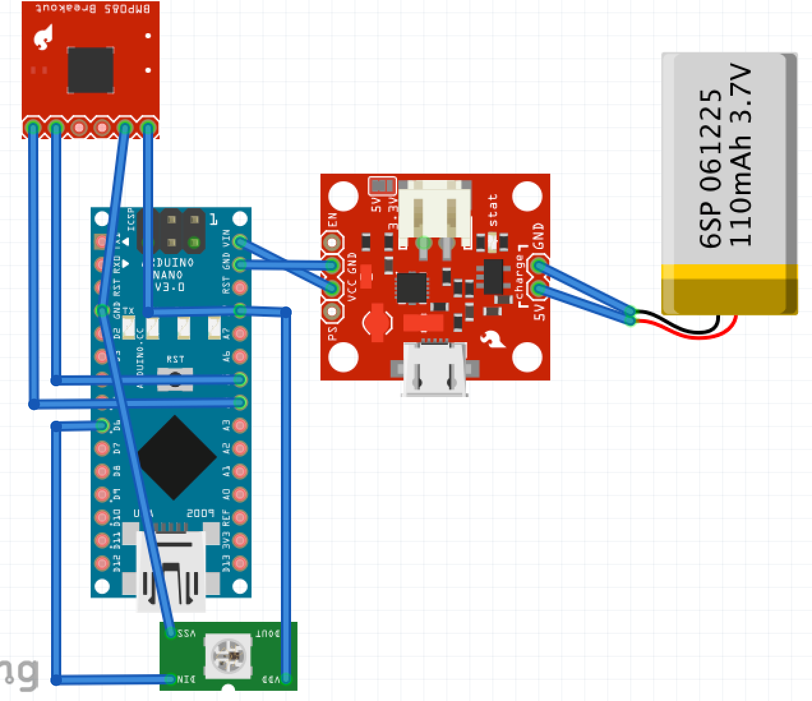

# Documentation for Breathing Mask

The purpose of this document is to explain the work I achieved during my time in Sendinaden. I will describe the last version I have and the reasons why I made the choice to make it this way.
The documentation is divided in four parts:

- Hierarchy of the files on the drive
- Electronic documentation
- Android application documentation
- Algorithm documentation

## 1. Hierarchy of the files on the drive

## 2. Electronic documentation
### 2.1. First version
#### 2.1.1. Main components
##### 2.1.1.1. The microcontroller
The microcontroller chosen for the electronic prototype is the [Arduino Bluno Nano](http://www.dfrobot.com/wiki/index.php/Bluno_Nano_SKU:DFR0296) from D.F. Robot.  
It is very compact and integrates Bluetooth Low Energy with a second embedded chip (TI CC2540) in parallel with the ATMega328 arduino chip. This board allows all data sent to serial to be sent via bluetooth as well.
##### 2.1.1.2. The sensor
The first sensor used is the [BMP180](https://www.adafruit.com/products/1603). It allows pressure, temperature and altitude readings.
The reading can be done through I2C, and you can see the connection [here](http://learn.adafruit.com/bmp085)  
**Note**: It's almost equivalent to the [BMP085](https://www.adafruit.com/products/391) and can be replaced by it.
##### 2.1.1.3. Power management
We use a simple lithium battery connected to a power charger. (see next section for connections). 
In the Arduino sketch, you'll find how we handle power management. However, the limit we face with the Arduino Bluno Nano, is that we can only put the ATMega chip to sleep. Meanwhile, the TI CC2540 BT is still active and the bluetooth is discoverable.
#### 2.1.2. Schema & Description

**Note:** *The composant shown in the schema are only representative and are not the actual real components. (For a list of the real components and where they have been bought, please read the inventory.*
#### 2.1.3. Limits
##### 2.1.3.1. Pressure variation outside the mask
###### Problem
The first problem encountered is the following situation.  
Whenever there is change of pressure ouside the mask such as:

 + door opening
 + going outside
 + going back inside
 + ...

Then the pressure is affected and the algorithms detects false inhalations or exhalations. Even worse, the calibrated value of the pressure (which saves the initial pressure when wearing the mask) is not valid anymore.  
###### Solution
To solve this problem, we decided to add another sensor which will keep measuring the pressure outside of the mask. This sensor will give us the real pressure and be a reference to compare to.  
The difference between the pressure inside and outside will then give us the real variation of pressure due to the breathing.
##### 2.1.3.2. I2C connections
Addind a second pressure sensor is easy. However with the current version of the sensor. We can only connect one sensor at a time, as the I2C address is fixed for every BMP180 sensor. The solution is explained in the next section.
### 2.2. Second version
#### 2.2.1. New pressure sensor
The new pressure sensor used is a new version of the BMP180: the BMP280.
This sensor also reads pressure, temperature and altitude. However the precision is more important, it has less noise and with the same conversion rate.
**Most importantly**, this sensor can use I2C *and* SPI, and allows us to connect a bunch of sensors.  
#### 2.2.2. Schema & Description

**Note:** *Again the composant shown are not the actual one, just a representation. But the connections are correct.*
#### 2.2.3. Limits
The limits with using two sensor are the following:
##### 2.2.3.1. Mask Design and airtightness
By adding a second sensor, we need to be able to install the second sensor outside of the mask to gather data about the environment. For that, we need to redesign the mask so we can have a place for the outside sensor.
This leads us to a second problem which is **airtightness**. Indeed, havind a sensor outside force us to have a hole to connect the 2nd sensor to the chip. Therefore we need to be really careful about airtightness.  
The solution we proposed is having a box with the two sensor inside, such as that the arduino board make the physical separation with the other side of the box, therefore isolating both sensors. There is a lot of room for improvement to this solution...
##### 2.2.3.2. Different conditions inside and outside
Another problem with using two sensor is that the conditions inside of the mask and outside are different (different temperature and humidity). So we need to take in account these variations in temperature as they impact the pressure inside of the mask[^note1]. 

## 3. Android application
Multiple version of the application have been developed. We document here only the last version, which is the one with the latest design. However this one doesn't include the data management (*doesn't save session files*).
The last version we have is on a private repository on [BitBucket](https://bitbucket.org/alaa_el_jawad/sendinaden)[^note4]. 
### 3.1. Overview of the application
An overview of the application screens is shown below.

### 3.2. Core components of the application
#### 3.2.1. Bluetooth Service
The bluetooth servive is the part that connects to the device. It's a modification of the official library of the bluno nano that you can find [online](https://github.com/DFRobot/BlunoBasicDemo).
#### 3.2.2. Data Management
This is the overview of how the data received by bluetooth from the arduino is processed.

The implementation can be found in the android application on the drive.
#### 3.2.3. Others
The algorithms is explained in the next section.

## 4. Algorithm
### 4.1. Goal of the algorithm
The final goal of the algorithm is simple: detect breathing and analyse it **in live**. To break it down to multiple points, here is what the algorithm shoud be able to do at the end:

 - Detection of inhalations, exhalation and holding breath
 - Extraction of informations on the breathing such as:
     + rate
     + depth
     + use of nose or mouth
     + detect use of thorax or belly while breathing.
 - Identification of the activity according to the previous informations
 - Detection of the level of stress
 - Detection of some disease that may affect breathing
 - ...etc

**Note:** *This list is non exhaustive and only describes some of the goals we fixed. It also doesn't describe the current state of the algorithm we developed.*

### 4.2. Principle of the algorithm
#### 4.2.1. Detection of the breathing
The detection of breathing is based on an analysis of the pressure's variations[^note2].  
##### 4.2.1.1. Exhalations/Inhalations/Holdings
After doing the calibration, inhalations/exhalations/holdings by using a simple threshold system like shown in the following graph.

##### 4.2.1.2. Splitting into breaths
After being able to detect the inhalations/exhalations/holding we can separate the breathing into different breathes. For that we use the following definition of a breath.  

Breath
:   a breath starts with an inhalation and contains at least an exhalation.

Using this definition allows us to separate the breathing into breathes. Now we can extract features from them.

##### 4.2.1.3. Extracting features from breaths and sessions
###### Depth
We evaluate the depth by integrating the pressure variations
###### Length
The length of a breath is the duration between the first inhalation and the detection of the next breath.
###### Pace (Breath/min)
Having the duration of the breaths, we can calculate easily the breath/min.
###### Nose vs Mouth
We discovered that depending on whether you use the nose or mouth to breathe the variations of pressure **AND** temperature are different.  
Indeed, when using the mouth, the variations of pressure and temperature are more important. In addition the average temperature rises.  
Therefore using the variations of the derivatives of pressure/temperature we have good chances to detect breathing through the mouth.

##### 4.2.1.4. Advanced algorithms
From here, everything is theory and speculations, nothing has been tested out yet.
The idea is to achieve advanced identifications and information extraction with the breaths we currently have. For that, we would use machine learning to teach the computer to identify different level of stress (sport, bad stress, relaxed, sleeping...etc).

### 4.3. Limits and link with the mask
#### 4.3.1. Limit of pressure & temperature analysis
Plotting the pressure recordings show the effect of breathing on the pressure. The first limit we face here is that breathing affects the pressure only when there is breathing, e.g. as soon as you hold your breath the pressure is not affected anymore and drops down back to the real pressure. Same for using the temperature. However the variations of pressure are more important than those of temperature.
#### 4.3.2. Noise & necessity of calibration
The noise is the reason why we always to have to calibrate at the start of the device. (*Calibration is always done at the start of the device.*)
In the case of **1 sensor**, the calibration is needed to get the min and max value of the noise. By calibrating, we also take the average value of the pressure to get the reference.
In the case of **2 sensors**, the calibration is needed to measure the min and max of the noise accumulated when calculating the difference of pressure. It also allow us to get the average difference between the readings of the 2 sensors.[^note3].
#### 4.3.2. Importance of being airtight
The whole principle of the recording the breathing is based on the variation of pressure inside of the mask. As a consequence, the more the mask is airtight the more the pressure variations will be noticeable. Therefore we always need to make sure the mask is airtight.  
However we need to keep in mind that the more airtight the mask is, the harder it is to breathe through, thus reducing the comfort.

--------
## Contact
For any more information, feel free to contact me: [ejalaa12@gmail.com](mailto:ejalaa12@gmail.com)

[^note1]: You can see this implementation of the variation of temperature in the android application source code.
[^note2]: The variation of pressure is defined by the difference between the pressure inside and the one outside *(or the calibrated one in case of the 1-sensor-electronic)*
[^note3]: Although, the sensors should read the same pressure, they are often different by a few pascal.
[^note4]: contact me to get the account information (username/password)
